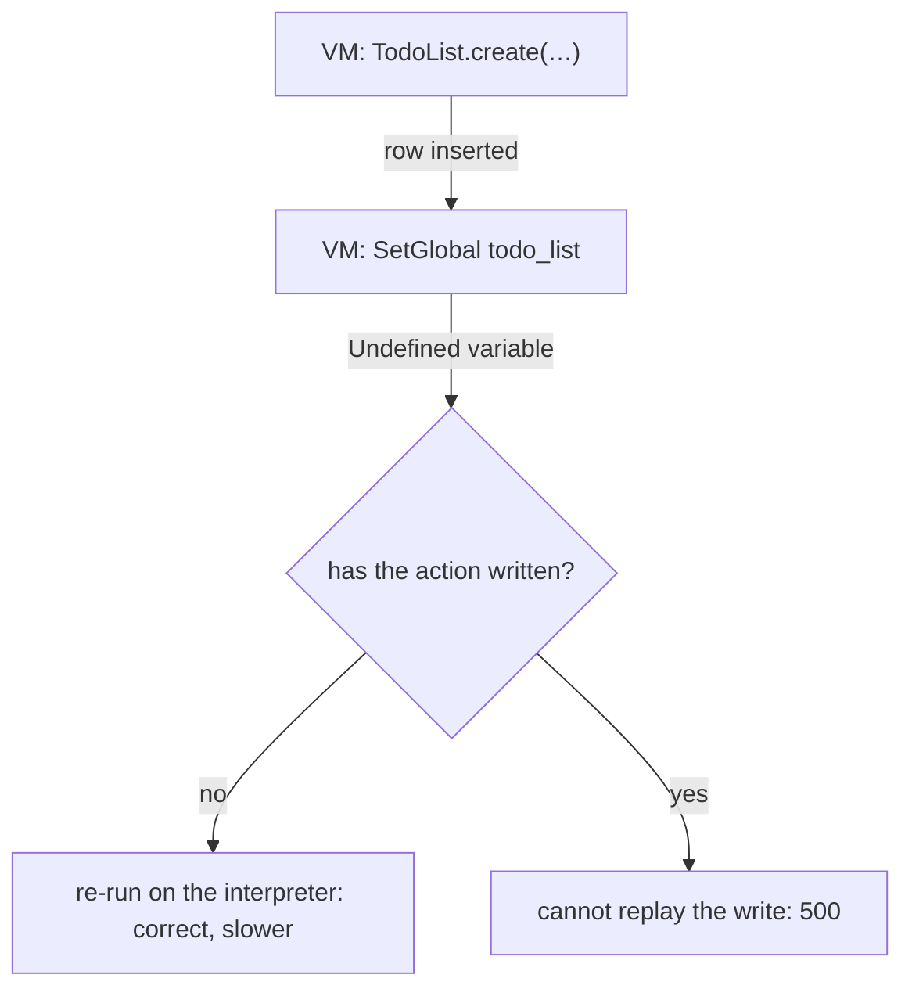

# Why Actions Skipped the VM

Soli has two engines. `soli test` and scripts run on a tree-walking interpreter,
which evaluates the syntax tree directly. `soli serve` compiles handlers to
bytecode and runs them on a virtual machine, which runs the same code more than
twice as fast. Over the 2.6 cycle the VM got a lot faster: a dispatch tier that
keeps the current frame in registers, small hashes stored as plain arrays, and
callback loops that run inside the dispatch loop. Every one of the twelve
callback benchmarks we track against Ruby 4.0 with YJIT now finishes ahead of it.

Then we measured an application, and requests per second barely moved.

The reason turned out to be one line of code that almost every controller action
contains. It made the VM give up on nearly every real action and hand it back to
the interpreter, silently. The first request failed on the VM and every later
one went straight to the interpreter. When the action had already written to the
database, it answered 500 instead. This post covers how we found it, why fixing
it meant closing half a dozen other differences between the two engines, and
what it is worth: the same action, 2.6 times faster.

<figure style="margin:1.5rem auto;max-width:1024px;">
  
  <figcaption style="text-align:center;color:#8b949e;font-size:0.875rem;margin-top:0.5rem;">The same action, before and after. The VM was always this fast; the action just wasn't on it.</figcaption>
</figure>

## A fast VM that requests never reached

The benchmark app has one action that does typical controller work: it builds 100
hashes, filters them twice, maps, sums, counts, and returns JSON.

```soli
class BenchController < Controller
  def work
    users = []
    for i in 0..100
      users.push({"id": i, "name": "user#{i}", "age": 18 + i % 50, "active": i % 3 != 0})
    end
    adults = users.filter(fn(u) u["active"]).filter(fn(u) u["age"] >= 30)
    # … map, sum, group, render JSON
  end
end
```

Timed on its own inside one process, the body of this action took 50 µs on the
VM and about 120 µs on the interpreter. Served over HTTP, each request cost
around 300 µs, whether the build was 2.5.5 or 2.6.1. That meant the handler
wasn't on the VM at all.

The first cause was deliberate. The server only sent an action to the VM when it
took the request as a parameter, `def work(req)`. A zero-parameter action like
`def work` reads the request through the `req` global and stayed on the
interpreter. That rule was added in 2.4.2, after 2.4.0 had sent zero-parameter
actions to the VM and "actions that had always worked there failed in
production." The change was reverted without anyone finding out why.

So we rewrote the action as `def work(req)` and measured again: **41k req/s**,
the same as before. It still wasn't running on the VM.

## `name = value` was an undefined global

Soli's `let` is optional. `users = []` creates a local variable, and that is the
style the docs recommend and almost every app uses. The interpreter has always
worked this way.

The VM can handle it too. Its compiler has a pre-pass that finds every name a
function assigns without `let` and declares it as a local at the top of the
body. But the pre-pass sat behind an environment variable,
`SOLI_VM_OPTIONAL_LET=1`, and it was **off by default**. With it off, a bare
assignment to a new name compiled to `SetGlobal`. At run time `SetGlobal` found
no global called `users` and raised *Undefined variable*.

The server catches that error and re-runs the handler on the interpreter. The
fallback is there so that a construct the VM can't handle degrades to slower
code instead of an error. Here it hid the fact that the VM ran almost nothing:
most actions assign a local on their first line, so they failed before doing any
work, and the interpreter re-ran them. The server then remembered the handler as
*demoted* and sent it straight to the interpreter from then on. The response was
correct, and unless `SOLI_ENGINE_LOG=1` was set, nothing said so.

The flag had been turned off on purpose. When it was introduced, turning it on
exposed several VM bugs with local variables inside `for`-with-index and
`try`/`catch`. Those were fixed in the same change. The flag stayed off
"until they are differentially tested". That testing has since happened: the
test suite that runs every snippet on both engines and compares the results has
run the VM with the flag on from the start. Nobody went back to change the
default.

## Why some actions answered 500

A silent fallback costs speed. It becomes a correctness bug once the action has
already done something the fallback can't undo.

To see what had broken in 2.4.0, we sent zero-parameter actions to the VM again
and ran the test suite of Bonfire, a project-management app built on Soli, with
425 of them. The first failure we traced:

```soli
def create_list
  todo_list = TodoList.create({"project_id": @project._key, "name": params["name"]})
  redirect("/c/" + @project.company_id + "/p/" + @project._key + "/todos/" + todo_list._key)
end
```

```
[ERROR] POST /c/…/p/…/todos - Undefined variable 'todo_list' at 163:0
```



The right-hand side of the assignment runs first, so `TodoList.create` inserts
the row before the assignment raises. The server can't re-run an action that has
already written: running it again would insert the list twice. It keeps a
durable-commit flag for exactly this case, and when the flag is set it reports
the error instead of retrying. The user gets a 500 and the database gets a
to-do list.

That is what happened in 2.4.0. Zero-parameter actions are most of the actions
in a real app, and `record = Model.create(...)` is one of the most common lines
in them.

## Every gap is a 500 once a write has happened

Optional `let` is now on by default in the VM. With it fixed, we sent every
action to the VM and reran Bonfire's suite. It failed **126** specs, against 25
on the interpreter.

That number is the real lesson. While a VM error could be re-run, every
difference between the two engines was invisible: it only made the action slower.
Once the error comes after a write, every difference is a 500. With optional
`let` fixed, execution got further before it hit the next difference, and many of
those came after a write. We closed them one at a time, rerunning the suite after
each:

| Gap | Example | What the VM does now |
|---|---|---|
| Model-instance members | `card.project` (a relation), `rec._errors` on a record without it, `asset.attach_file(…)` | resolves them through the interpreter's own instance access, the single definition of those rules |
| Query builders | `Post.where(…).order(…).all`, `.count`, scopes | same, through the interpreter's query-builder code; `each`/`map`/`filter` with a block run on the VM's own array methods |
| An inherited method the VM never compiled | `this._base()` inside a base controller's helper failed: `this` was a function | compiles it as a method on first call, with the receiver in place |
| A zero-argument method read without parentheses | `@kpis = @_kpis`, `Assistant.history_messages` | calls it, as the interpreter does |
| `sort` with a comparator | `names.sort do \|a, b\| … end` raised *expected 0, got 1* | orders by the comparator's sign |
| A trailing `if` | an action ending in `if post … redirect("/") end` returned null and rendered its form | returns the taken branch's value |

The last one is worth a second look, because nothing errored. The signup action
reached `redirect("/")`, the VM threw the value away, and the server rendered
the form again with a 200. The spec failed on the status code; in production the
user would have been signed up and shown the sign-up form.

For the first two gaps the VM calls the interpreter's code rather than growing a
copy of it. Model instances resolve relations, preloads, translations, state
machines and uploaders in several hundred lines, and a second copy would start
drifting from the first the day it was written. The one exception is a block:
`posts.each(fn(post) …)` materializes the rows and runs on the VM, because a
compiled closure has to be called by the VM that holds the variables it captures.

After those fixes, Bonfire fails **22** specs with every action on the VM,
against 25 on the interpreter. None fails on the VM alone. Task-orchestrator,
another app, fails exactly the same specs on 2.6.1 and on the new build. Each
fix also added a case to the test that runs a snippet on both engines and
compares the output.

## What it is worth

We also found a second problem while profiling the interpreter side. For line
coverage, the interpreter looked up the current file on every expression and
every statement it evaluated, and the lookup returns a new `PathBuf`: a heap
allocation and a copy of the path. Only after that did it check whether coverage
was being collected, which under `soli serve` it never is. The check now comes
first and is a single load. Views, scripts and `soli test` all benefit.

Measured on the shipped build (fat LTO, one codegen unit), with 100 concurrent
connections, best of three runs:

| Action | v2.6.1 | Now |
|---|---:|---:|
| `def work` | 40.7k req/s (interpreter) | **106.3k** req/s (VM) |
| `def work(req)` | 41.4k req/s (interpreter) | **106.4k** req/s (VM) |
| trivial JSON response | ~250k req/s | ~255k req/s |
| static HTML page | ~268k req/s | ~270k req/s |

The action is **2.6 times faster**, with or without `(req)`, because the VM
speedups from the 2.6 cycle finally apply to it. The trivial endpoints don't
move: routing, I/O and the view dominate there, not the handler.

## What to take away

For your app:

- **Nothing to change.** Keep writing `name = value` without `let`, and keep
  `def index` without a parameter. Both run on the VM now.
- To see which handlers still leave the VM and why, run the server with
  `SOLI_ENGINE_LOG=1`: it prints one line per handler per worker. The
  `soli_vm_handler_demotions_total` metric on `/_metrics` counts them. Batch
  iteration (`find_each`, `in_batches`) is the one known case left.
- If an action behaves differently after upgrading, `SOLI_VM_OPTIONAL_LET=0`
  restores the old assignment behavior while you report it.

For us, the lesson is about the fallback. It was designed as a safety net and it
became a blindfold: it made the VM's failures invisible, and benchmarks measured
the VM in isolation, where there was no fallback to hide them. We now measure
through `soli serve`, where the fallback is part of what gets measured, and treat
every difference between the engines as a bug to close rather than a case to
hand back.
